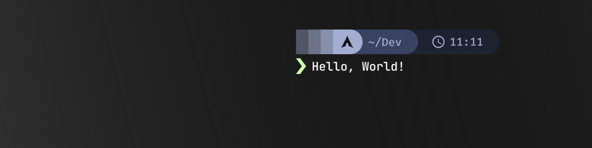

###

<h3>I'm Shubham, a Software Developer with passion for coding and problem solving using</h3>

- 🚀 Exploring different aspects of programming in various fields
- 🔭 I'm currently learning Game Development
- ❓ Ask me anything related to technologies
- ⚡ Fun fact: I know how to exit VIM

 

---

###

### Skill Set

  
  
  
  
  
  
  
  
  
  
  
  
  
  
  
  
  
  
  

 

---

### Connect with me

  
  
  
  

 

### Github Stats

  
  

 

###

---

# Blog posts

<!-- BLOG-POST-LIST:START -->
<!-- BLOG-POST-LIST:END -->
